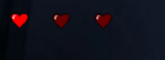
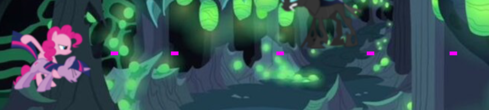

# Создание игры на Python
## Введение
Pony.exe — это простая аркадная игра, разработанная с использованием библиотеки Pygame. Игрок управляет героем, который стреляет по врагам, чтобы набрать очки. Игра включает в себя элементы управления, звуковые эффекты, а также логику игры, включая жизнь персонажа и систему очков.
## Логика подсчета попаданий
  
  
В игре используется переменная hit_count для подсчета количества попаданий по врагу (hero1). При каждом попадании в hero1, счетчик увеличивается на единицу и воспроизводится звук попадания.
### Код для обработки попаданий
Когда пуля сталкивается с hero1, выполняется следующий код:
```python
if bullet.colliderect(hero1_rect):
    bullets.remove(bullet)  # удаляем пулю
    pow_sound.play()  # воспроизводим звук попадания
    hero1_rect.left = 800  # перемещаем hero1 за пределы экрана
    hero1_rect.y = random.randint(0, 289)  # новая случайная позиция по вертикали
    hit_count += 1  # увеличиваем счетчик попаданий
```
- Удаление пули: Пуля удаляется из списка bullets.
- Воспроизведение звука: Проигрывается звук попадания (pow_sound).
- Перемещение врага: Позиция hero1 сбрасывается за пределы экрана, и ему присваивается случайная вертикальная координата.
- Увеличение счетчика: Переменная hit_count увеличивается на 1.
### Отображение очков 
Функция display_score отвечает за отображение текущего количества попаданий на экране:
```python
def display_score():
    hit_surface = text_font_score.render(f'Hits: {hit_count}', False, 'White')
    hit_rect = hit_surface.get_rect(center=(400, 380))
    screen.blit(hit_surface, hit_rect)
```
- Создание текста: С помощью text_font_score создается текст с текущим количеством попаданий.
- Отображение на экране: Текст рисуется в указанной позиции.
## Логика отниманий жизней
  
  
Количество жизней игрока отслеживается с помощью переменной lives, которая инициализируется значением 3. При каждом столкновении с hero1 количество жизней уменьшается на 1.
### Код для обработки столкновений
Обработка столкновения с hero1 выглядит следующим образом:
```python
if hero_rect.colliderect(hero1_rect):
    lives -= 1  # уменьшаем количество жизней
    if lives > 0:  # воспроизводим звук потери жизни только если осталось больше одной жизни
        loss_sound.play()
    hero1_rect.left = 800  # перемещаем hero1 за пределы экрана
    hero1_rect.y = random.randint(0, 289)  # новая случайная позиция по вертикали

    # Если жизни закончились, показываем сообщение
    if lives <= 0:
        gameover_sound.play()  # воспроизводим звук проигрыша
        pygame.mixer.music.stop()  # останавливаем фоновую музыку
        screen.blit(text_collide, text_collide_rect)
        ...
```
- Уменьшение жизней: При столкновении с hero1 переменная lives уменьшается на 1.
- Воспроизведение звука: Звук потери жизни (loss_sound) проигрывается только если осталось больше одной жизни.
- Сброс позиции врага: Позиция hero1 сбрасывается за пределы экрана с новой случайной вертикальной координатой.
- Проверка на окончание игры: Если lives становится равным 0, воспроизводится звук проигрыша, останавливается фоновая музыка и отображается сообщение о завершении игры.
## Логика стрельбы

  
Игрок может стрелять, нажав на левую кнопку мыши. При каждом выстреле создается новый объект пули, который добавляется в список bullets.
### Код для обработки выстрелов
Вот как выглядит код для обработки нажатия кнопки мыши:
```python
if game and event.type == pygame.MOUSEBUTTONDOWN and event.button == 1:
    bullet_rect = bullet_image.get_rect(center=(hero_rect.right, hero_rect.centery))
    bullets.append(bullet_rect)
```
- Создание пули: Новый прямоугольник (bullet_rect) создается в позиции, соответствующей положению героя.
- Добавление в список: Пуля добавляется в список bullets, чтобы отслеживать все выстрелы.
### Обработка движения пуль
Пули двигаются вправо с определенной скоростью. Если пуля выходит за пределы экрана, она удаляется из списка bullets.
```python
for bullet in bullets[:]:
    bullet.left += 10  # двигаем пулю вправо
    if bullet.left > width:  # удаляем пулю, если она вышла за пределы экрана
        bullets.remove(bullet)
```
- Движение пуль: Каждая пуля перемещается вправо на 10 пикселей.
- Удаление пуль: Если пуля выходит за пределы экрана, она удаляется из списка.

Ссылка на саму игру ---> [PONY.EXE](pygame.zip)  
